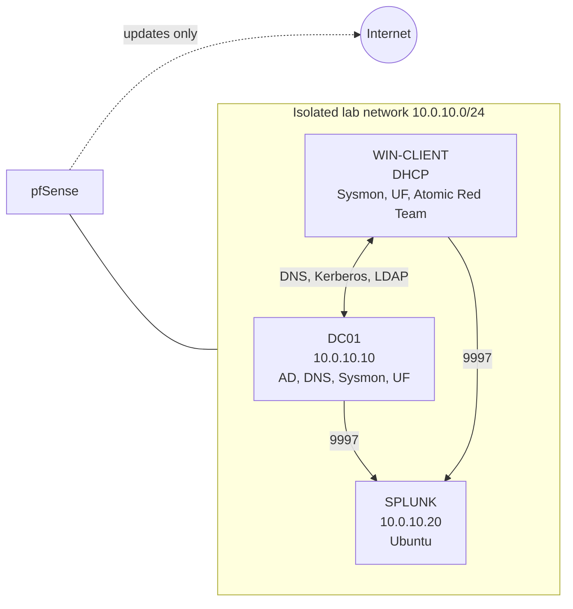

```mermaid
flowchart LR
  subgraph Lab["Isolated lab network 10.0.10.0/24"]
    DC["DC01<br/>10.0.10.10<br/>AD, DNS, Sysmon, UF"]
    CL["WIN-CLIENT<br/>DHCP<br/>Sysmon, UF, Atomic Red Team"]
    SP["SPLUNK<br/>10.0.10.20<br/>Ubuntu"]
    CL <-->|DNS, Kerberos, LDAP| DC
    DC -->|9997| SP
    CL -->|9997| SP
  end
  GW["pfSense"] -.->|updates only| NET((Internet))
  GW --- Lab
```
